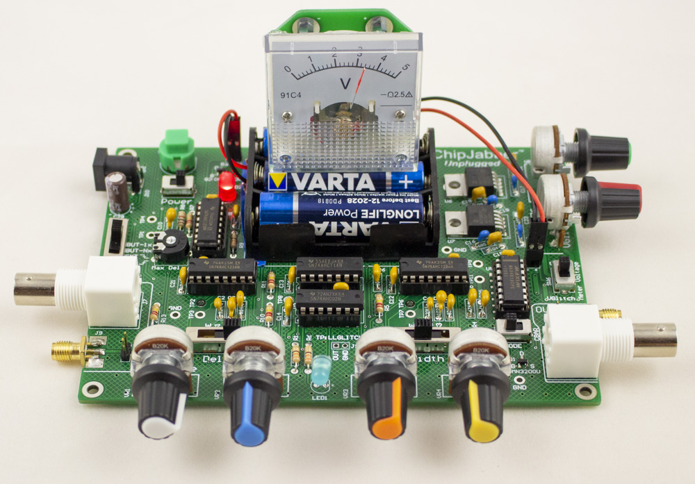

# Documentation

ChipJabber™ Unplugged is a voltage fault injection tool by [NewAE Technology Inc](https://www.newae.com). It's the voltage glitch tool that you can build yourself, no programmable logic in site! If you want a more "useful" tool you'll probably want programmable logic (such as found in our ChipWhisperer tooling), but if you want to have some fun building a kit with lots of knobs, ChipJabber-Unplugged is your game.

The documentation for it is held in this repo, but you should browse it at 

https://newaetech.github.io/chipjabber-unplugged

## ⚠️ WARNING

This is currently a work in progress! Not everything is uploaded to the repo OR documented yet!

### Building Documentation

If you want to build the documentation for local testing, just do this:

	pip install mkdocs-material
	mkdocs serve

Then go to where it says (normally 127.0.0.1:8000). As you change files it will automatically rebuild and update the file (super-easy!).
