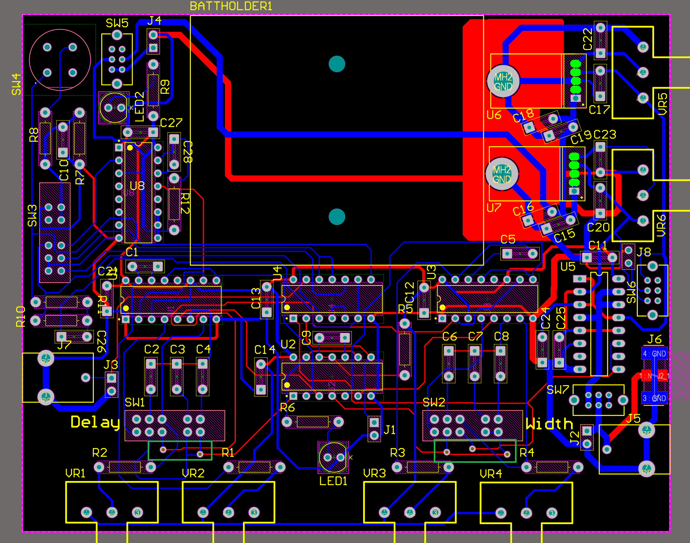

## Simple PCB


This folder contains the following folders you may need for PCB generation:

```
	gerber_ncdrill		         Gerber files generated at 2.3 imperial
    gerber_ncdrill_copperonly    Same files as above, with only GTL (Top Copper), BTL (Bottom Copper), and NC-Drill file
```

The `gerber_ncdrill_copperonly` should basically just work in the Bantam software. The board is designed to run on a 4x5 inch double-sided PCB. You may also need the .GM1 file (outline), but be sure to DISABLE IT, as it will run the tool into the holding jig.

### Vias & Through-Hole

There are 6 vias on the board, highlighted in a green square below, they are near the bottom edge of the PCB near R1 & R4.



Be sure to join those using wires soldered on both sides.

The other 2-layer joins are done using PCB legs. You'll need to use machine pin DIP sockets, and raise them up off the PCB. This will let you solder them from both sides, as many PCB 2-layer jumps are done using it. In particular, be sure to solder the top-side of the following IC pins:

* U8: Pin 13
* U1: Pin 1, 5, 8, 10, 11, 16
* U4: Pin 1, 2, 7, 13, 14
* U2: Pin 1, 3, 4, 6, 8, 9, 11, 12, 13, 14
* U3: Pin 1, 2, 5, 8, 11, 16
* U5: Pin 1, 2, 3, 5, 9, 12, 13

In addition, the two TO220-5 power regulators need from the top-side:
* U6, U7: Pin 3 (middle pin)

J8 & J4 both have one pin that needs to be soldered from top-side (may need extra-long headers to do these).