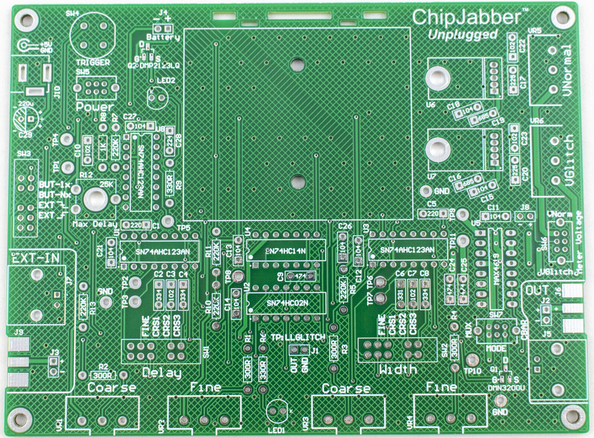

## Electronics Kit

## Parts

### Blank PCB

The blank PCB is marked with the mounting information for most parks. The following notation is used:

* 330R: a 330-ohm 1/4W resistor.
* 104: a 100nF capacitor. The part code should match what is used on the capacitor, where 104 means "10 x 10000" = 100000pF = 100nF for example. See more details on general electronics parts notes.

### Surface Mount Parts

There are two surface-mount parts used. You can actually skip installing the parts if you wish (if you are not comfortable soldering SMD parts). If you do not install them, note the following:

* Q1: If Q1 is not installed, the "crowbar" output is not available. This means SW7 should be set to `MUX` mode always.

* Q2: Diode D1 must be installed if Q2 is not installed. Diode D1 provides reverse polarity protection, but has a small voltage drop that limits your maximum voltage. Installing Q2 means you have almost no voltage drop, and can output a slightly higher maximum voltage.

