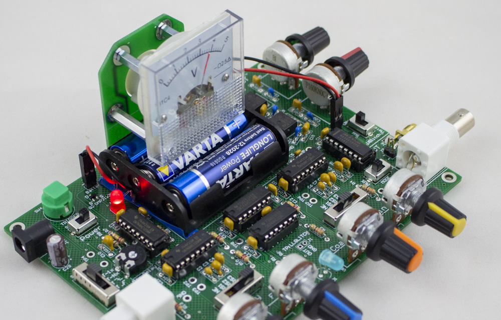
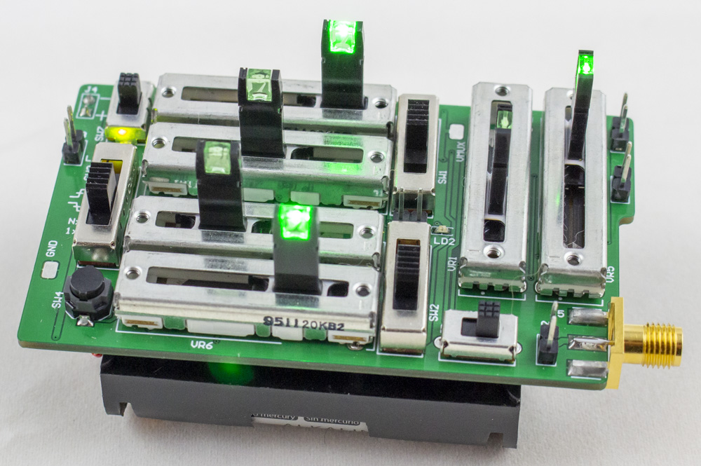
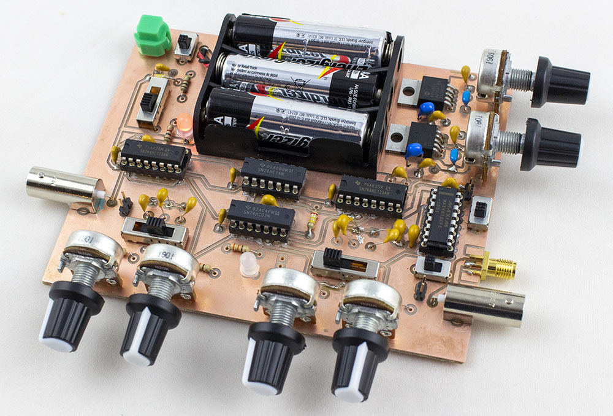
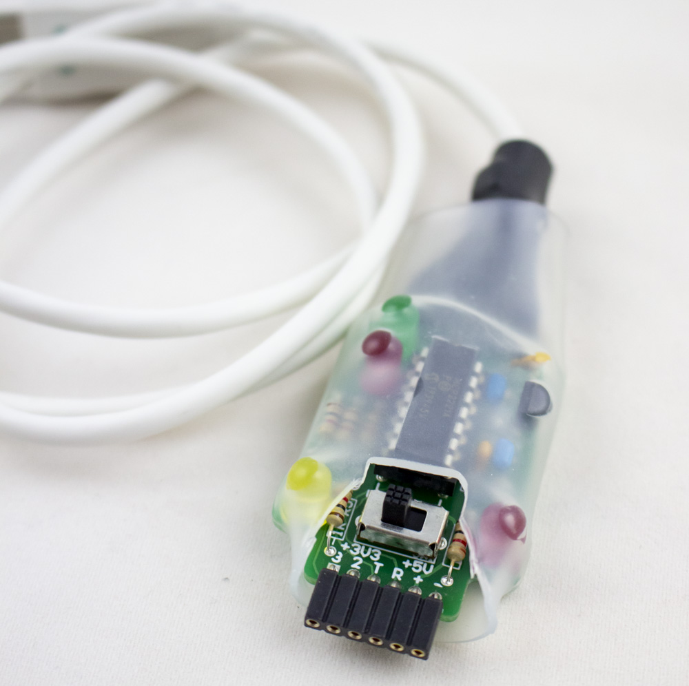
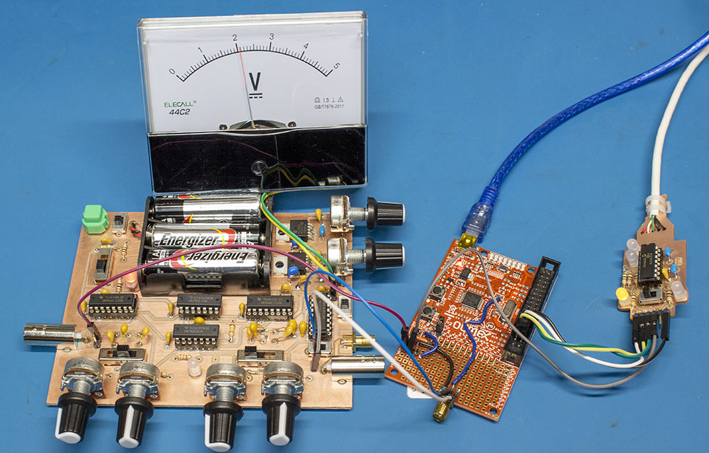

ChipJabber™-Unplugged is a voltage fault injection tool by [NewAE Technology Inc](https://www.newae.com). It's the voltage glitch tool that you can build yourself, and features *not a single piece of programmable logic anywhere in sight*.

This device was discussed in detail in the July 2020 issue of [Circuit Cellar](http://circuitcellar.com/).

See the pages on menu at left for more details of how it works, and see the [GITHub Repository](https://www.github.com/newaetech/chipjabber-unplugged) for relevant design documents.

The objective of this project is to teach you about voltage fault injection & how easily it can be performed. When you go to do real work you probably *want* some programmable logic to make it easier to sweep glitch parameters and settings, without spending all your time tweaking knobs. You can check out the [ChipWhisperer](https://www.newae.com/ChipWhisperer) project & the [ChipSHOUTER](https://www.newae.com/chipshouter) tools for more advanced fault injection tools, and the [ChipWhisperer.io Online Training](https://learn.chipwhisperer.io) might be of interest to you to understand how this all works.

!!! WARNING

	This repo is still a work in progress. The uploaded material currently supports the Circuit Cellar article. More details of the full kits is coming shortly, check back soon. Annoucements will come via [NewAE Technology's low-volume newsletter](https://tinyletter.com/newaetech).
	
!!! INFO
	
	Check out the [Crowd-Supply Page](https://www.crowdsupply.com/newae/chipjabber-unplugged) for more details. Currently it's just a blank sign-up to be notified when kits are available!

## Variants

There are three versions of ChipJabber-Unplugged, which use almost the same architectures (only some minor differences):

* *ChipJabber-Unplugged Kit*: This kit is a classic electronics kit, using almost all through-hole electronics parts. You can build this design on a breadboard or perfboard as well if you wish using the provided schematic.
* *ChipJabber-Unplugged Mini*: This is a pre-built unit, using surface-mount electronics to make a much smaller version. Not available as a kit due to the hassle of making SMD kits (sorry).
* *ChipJabber-Unplugged Old-School PCB*: This board is designed to be built with home-etch boards (minimal number of vias), or a PCB mill such as the Bantam PCB Mill. It's a slightly simplified version of the normal ChipJabber-Unplugged. The board exactly fits the [Bantam PCB Mill](bantamtools.com) working area.

### ChipJabber-Unplugged Kit

### ChipJabber-Unplugged Mini

Need to glitch on the go, but still want to twiddle those settings physically? No worries, ChipJabber-Unplugged Mini is slightly larger than the 3x AA batteries powering it, and features excessively large "slider" style potentiometers. Here's an early photo of it:

### ChipJabber-Unplugged Home-Etch PCB

Firing up the tank of ferrochloric acid, or spinning up your PCB mill? A special edition of the board is done with double-sided logic, but minimizing the number of vias

## Tools

Any of the glitchers can be used in combination with some other cool tools as part of the project:

### NOTDuino Secure Boot

Now that you've got a glitcher, what do you do? While we include the NOTDuino "Secure Boot" demo board, which uses a very simple EEPROM as a "key" to validate the boot process. This board is can be programmed via the Arduino IDE by plugging in a serial-to-USB adapter, such as the DIPUSB tool below.

### DIPUSB

How are you going to talk 3.3V serial to your device? No worry, the all-through-hole DIPUSB adapter will work for you:

## Real-Life Usage

ChipJabber-Unplugged is designed more for fun than "real-life" usage. But - you can do real stuff with it. Why not recreate [Chris Gerlinsky](https://twitter.com/akacastor)'s [LPC Code Read Protection attack](https://recon.cx/2017/brussels/resources/slides/RECON-BRX-2017-Breaking_CRP_on_NXP_LPC_Microcontrollers_slides.pdf)?

---

ChipJabber is a trademark of NewAE Technology Inc.

This documentation is built using [MkDocs](https://www.mkdocs.org/) and [Material for MkDocs](https://squidfunk.github.io/mkdocs-material/).
