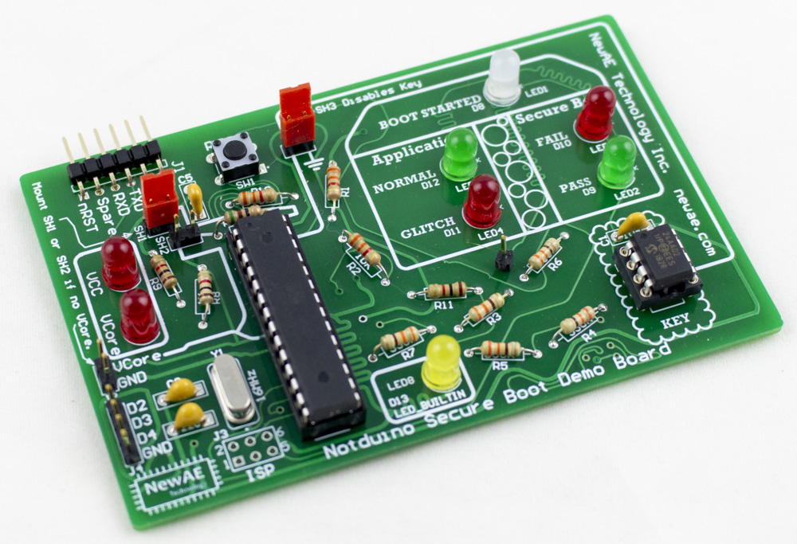

ChipJabber™ is a voltage fault injection tool by [NewAE Technology Inc](https://www.newae.com). It's the voltage glitch tool that you can build yourself! 

See the architecture tab for more details of how it works. Some overview photos are below:

## Variants

There are three versions of ChipJabber-Unplugged, which use almost the same architectures:

* *ChipJabber-Unplugged Old-School PCB*: This kit is designed to be built with home-etch boards (minimal number of vias), or a PCB mill such as the Bantam PCB Mill.
* *ChipJabber-Unplugged Kit*: This kit is a classic electronics kit, using almost all through-hole electronics parts. 
* *ChipJabber-Unplugged Mini*: This is a pre-built unit, using surface-mount electronics to make a much smaller version.

### ChipJabber-Unplugged

### ChipJabber-Unplugged Mini

### ChipJabber-Unplugged

## Tools

Any of them can be used in combination with some other cool tools as part of the project:

### NOTDuino Secure Boot

### DIPUSB

## Real-Life Usage

ChipJabber-Unplugged is designed more for fun than "real-life" usage. But - you can do real stuff with it. 

TODO - example.

---

ChipJabber is a trademark of NewAE Technology Inc.

This documentation is built using [MkDocs](https://www.mkdocs.org/) and [Material for MkDocs](https://squidfunk.github.io/mkdocs-material/).