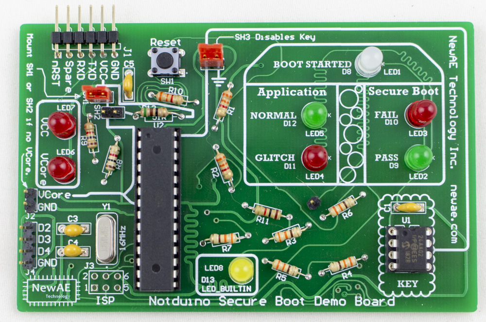

The [NOTDuino](https://wiki.newae.com/CW304_Notduino_Target) was originally part of the ChipWhisperer-Lite Kickstarter campaign.

This is extended to now work as a "secure boot" demo board. The "secure boot" isn't really that secure, as the default version of it
looks just for a special I2C EEPROM magic value.



## Background

## Boot Process Summary

The NOTDuino boot process is as follows:

 1. Check if I2C bus appears to be available (not stuck). If bus is stuck, we stop boot.
 2. Try talking to an I2C EEPROM at address `0x50`, and read address `0xA7`. If the read fails, stop boot.
 3. Check that address `0xA7` is set to magic value `0xDE`. If this is true, continue boot, otherwise stop boot.

The I2C socket is designed to also accept a XXXX device, which would be closer to a more relevant secure device. Unfortunately shipping those devices triggers certain export rules, so we instead use the simple EEPROM in the kit.

## Application Code

If the boot succeeds, the following code is run in a loop:

```C  
  cnt = 0;
  for (i=0; i < 200; i++){
    for(j=0; j < 200; j++){
      cnt++;  
    }
  }
  if(cnt == 40000){
    digitalWrite(LED_NORMAL, HIGH);
  } else {
    digitalWrite(LED_GLITCH, HIGH);
  }
```

This should result in the `NORMAL` blinking green. If you see the `GLITCH` blink red, it means you have successfully glitched the code, without crashing the target device!

## Glitching the Boot

Once you get a useful glitch, you should try glitching secure boot. Insert the jumper at SH3 which shorts the I2C line, thus disabling the key (same as if the EEPROM was removed or loaded with incorrect data).

The device will now lite the `FAIL` boot LED. Oh no! If you looked at the code, the implementation works like this:

```C
  if(boot_ok() == 0) {
    digitalWrite(LED_FAIL, HIGH);
    Serial.print("Boot FAILED - application blocked\n");
    while(1);
  } else {
    digitalWrite(LED_OK, HIGH);
    Serial.print("Boot OK\n");
  }
```

### Glitching Manually

The first thing you can do is use the push-button trigger on the ChipJabber-Unplugged, and simply try glitching out of the ```while(1)``` loop. If you are successful, you'll see the `NORMAL` LED start flashing as the application is now running. The boot will still be marked as `FAIL`, since we didn't actually bypass the boot check, just glitched out of the loop.

### Glitching Automatically

Using the PCB trace going to LED1, you can solder a pin header into one of the vias. This will now be used as a trigger for a rising-edge input trigger.

You'll have to experiment with the delay setting, but you should be able to get the device to automatically start running the application after a reset. Use the reset switch (`SW1`) to keep resetting the device.  

## Building the Kit

## Errata

Note in the various photos 3.3K resistors are used in place of 10K, as I ran out of 10K when I built this. Will be fixed in later photos. 